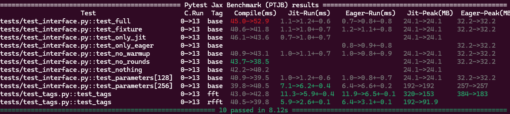
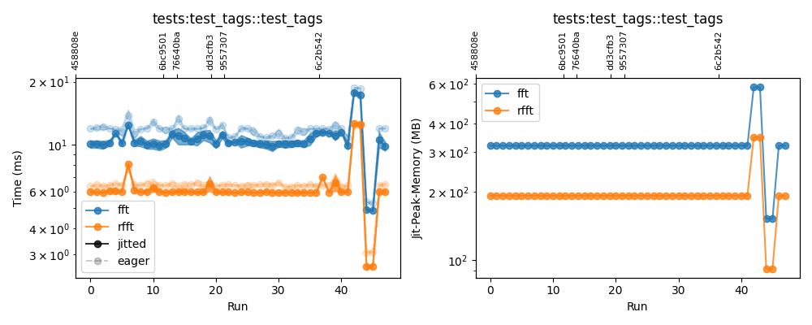

# pytest-jax-bench
A pytest plugin to benchmark memory usage, compilation time and run time of jitted JAX functions. This code is inspired by [pytest-benchmark](https://pytest-benchmark.readthedocs.io/en/latest/). It has only been tested on GPU with jax=0.7.2 and CUDA13 so far.

## Installation
First install [jax](https://docs.jax.dev/en/latest/installation.html) with GPU support and then...

```bash
pip install -e .[plot]     # With optional plotting support (requires matplotlib)
pip install -e .           # In general
```
If you don't want to edit the project, you can skip the "-e"

## Usage

Define a [pytest](https://docs.pytest.org/en/stable/index.html) unit test, e.g. in a file "tests/test_benchmark.py":
```python
import jax
import jax.numpy as jnp

def fft(x): # An example function we want to profile
    return jnp.fft.ifftn(jnp.fft.fftn(x))

def test_fft(jax_bench):  # jax_bench is a fixture that creates a JaxBench object.
    x = jnp.ones((256, 256, 256), dtype=jnp.float32)

    jb = jax_bench(jit_rounds=20, jit_warmup=1, eager_rounds=10, eager_warmup=1)
    jb.measure(fn=fft, fn_jit=jax.jit(fft), x=x)
```
Then simply run your tests as usual with [pytest](https://docs.pytest.org/en/stable/getting-started.html). E.g.
```
pytest -v
```
The benchmark results will only be displayed if you use the "-v" (verbose) option. However, they will always be saved to a ".csv" file in a simple to read table -- by default in the `.benchmarks` directory.

The `jb.measure` call in the example above will take the following steps:

* An eager execution warmup run using `fn`
* Save the measured peak memory usage. (This measurement has additional requirements as discussed below.)
* Average the run-time of eager execution over 10 loops using `fn`. 
* Compile the jitted function using `fn_jit`
* Save the predicted memory usage of the jitted function (including peak memory, temporary memory and memory used by folded constants)
* Average the run-time of the jitted function over 20 loops, using `fn_jit`

Different stages can be skipped by setting the measurement parameters to 0 or by not passing `fn` or `fn_jit`.

### Eager exeuction memory

So far I didn't find a reliable way to measure the eager execution peak-memory usage that does not require restarting the measuring process. Therefore, this part of the measurement will be invalidated unless you execute with the `--forked` flag provided by `pytest-forked`
```bash
#pip install pytest-forked  # If you didn't install it already
pytest --forked
```
However, this may significantly slow down execution due to the additional python launch required for each test. (If you know a better way to profile the memory used by jax, don't hesitate to contact me!) For now, I'd recommend to launch normally in general and only use `--forked` once in a while, when you really want to know the eager memory usage.

### Optional parameters
All the optional parameters are listed in ```pytest --help```. Since the help file can be a bit overwhelming, you can specifically find all the options defined by pytest-jax-bench (ptjb) as follows:
```bash
pytest --help | grep ptjb -A 2
```

### Alternative usage:
Fixtures in pytest don't go too well with syntax highlighting. If you want proper code completion, you can also create the `JaxBench` object explicitly in your unit test, leading to the exact same result.
```python
from pytest_jax_bench import JaxBench

def test_fft_alt(request):
    x = jnp.ones((256, 256, 256), dtype=jnp.float32)

    jb = JaxBench(request, jit_rounds=20, jit_warmup=1, eager_rounds=10, eager_warmup=1)
    jb.measure(fn_jit=jax.jit(fft), x=x)
```
> Note: We still need to pass the `request` fixture to the JaxBench object.

### Tags
It is possible to do several measurements inside of the same test if you provide a tag to each run:
```python
def rfft(x):
    return jnp.fft.irfftn(jnp.fft.rfftn(x*2.))

def fft(x):
    return jnp.fft.ifftn(jnp.fft.fftn(x*2.))

def test_tags(request):
    x = jnp.ones((256, 256, 256), dtype=jnp.float32)

    jb = JaxBench(request, jit_rounds=10, jit_warmup=1, eager_rounds=5, eager_warmup=1)

    jb.measure(fn=fft, fn_jit=jax.jit(fft), x=x, tag="fft")
    jb.measure(fn=rfft, fn_jit=jax.jit(rfft), x=x, tag="rfft")
```
So far, this doesn't support eager memory at all (even when using `--forked`)

In this case tests with several tags will be saved to the same file and they will be plotted together by default. Note that the plots skip some less relevant aspects in this case to keep it simple.

### Usage outside of pytest
You can also use the benchmark class independently of pytest:
```python
from pytest_jax_bench import JaxBench

jb = JaxBench(jit_rounds=10, jit_warmup=2, eager_rounds=5, eager_warmup=1)
res, out = jb.measure(fn=rfft, fn_jit=jax.jit(rfft), x=x, write=False)
print(res)
```

### Examples:
For more examples check the [examples](tests/test_examples.py).

## Outputs

Outputs of tests come in three different varieties. (1) Files (.csv) that log the results of the benchmarks (one per test). (2) The terminal output displayed if using "-v" (3) Overview plots that can be created optionally.

### The .csv files

Each test creates a csv file in `--ptjb-output-dir` (defaults to `.benchmarks`) named after the nodeid of the test. For example this is the file ".benchmarks/tests:test_interface::test_full.csv" that was creates by running the unit tests in this directory several times:
```
# pytest-jax-bench
# created: 2025-10-16T19:58:11Z
# test_nodeid: tests/test_interface.py::test_full
# backend: gpu
# device: NVIDIA GeForce RTX 4070 Laptop GPU
# First commit: 6bc9501
#  (1) run_id
#  (2) commit
#  (3) commit_run
#  (4) tag
#  (5) compile_ms
#  (6) jit_mean_ms
#  (7) jit_std_ms
#  (8) eager_mean_ms
#  (9) eager_std_ms
# (10) jit_peak_bytes
# (11) jit_constants_bytes
# (12) jit_temporary_bytes
# (13) eager_peak_bytes
# (14) jit_rounds
# (15) jit_warmup
# (16) eager_rounds
# (17) eager_warmup
#        (1)         (2)         (3)         (4)         (5)         (6)         (7)         (8)         (9)        (10)        (11)        (12)        (13)        (14)        (15)        (16)        (17)
           0     6bc9501           0        base       40.65        1.11        0.46        0.78        0.51    25296896           4     8519680    33816576          10           2           5           1
           1    6bc9501+           1        base       46.39        0.99        0.49        1.01        0.52    25296896           4     8519680    33816576          10           2           5           1
           2     76640ba           0        base       43.14        1.14        0.41        0.85        0.57    25296896           4     8519680    33816576          10           2           5           1
           3     76640ba           1        base       43.19        0.91        0.49        0.54        0.02    25296896           4     8519680    33816576          10           2           5           1
 [...]
```
Each run creates a line in this table. The active git-commit is logged (a "+" indicates a "dirty" commit with some uncommited changes in the directory.) anda per-commit run-id is tracked additionally for convenience. If you want to work with the raw data of these ".csv" files you can use 
```python
from pytest_jax_bench import load_bench_data
data = load_bench_data(".benchmarks/tests:test_interface::test_full.csv")
```
This reads the data into a [numpy structured array](https://numpy.org/doc/stable/user/basics.rec.html) that you can easily index with strings, e.g.
```python
print(data[-2:]["commit"], data[-2:]["jit_mean_ms"], "+-", data[-2:]["jit_std_ms"])
```
to print the last two runs' commit, average runtime and measurement uncertainty. Measurements may be set to "np.nan" for invalid timings or "-1" for invalid memory values.

### The terminal output
If you run pytest with "-v" option you will get a terminal output similar to this:


<!-- ```
===================================================== Pytest Jax Benchmark (PTJB) results ======================================================
                     Test                       C.Run  Tag   Compile(ms)    Jit-Run(ms)     Eager-Run(ms)   Jit-Peak(MB)  Eager-Peak(MB)
tests/test_interface.py::test_full             0->4   base  45.0->54.0   1.1->0.9+-0.7    0.7->0.8+-0.7    24.1->24.1    32.2->32.2
tests/test_interface.py::test_fixture          0->4   base  40.6->44.7   1.1->1.2+-0.6    1.2->1.0+-0.8    24.1->24.1    32.2->32.2
tests/test_interface.py::test_only_jit         0->4   base  46.1->48.5   0.7->1.2+-0.6                     24.1->24.1
tests/test_interface.py::test_only_eager       0->4   base                                0.8->0.8+-0.7                  32.2->32.2
tests/test_interface.py::test_no_warmup        0->4   base  40.9->42.7   1.0->1.0+-0.7    1.0->0.8+-0.7    24.1->24.1    32.2->32.2
tests/test_interface.py::test_no_rounds        0->4   base  43.7->45.2                                     24.1->24.1    32.2->32.2
tests/test_interface.py::test_nothing          0->4   base  42.2->40.3                                     24.1->24.1
tests/test_interface.py::test_parameters[128]  0->4   base  40.9->38.5   1.0->1.1+-0.6    1.0->0.8+-0.7    24.1->24.1    32.2->32.2
tests/test_interface.py::test_parameters[256]  0->4   base  39.8->40.8   7.1->7.0+-0.1    6.4->6.5+-0.1    192->192      257->257
tests/test_tags.py::test_tags                  0->4   fft   43.0->43.7   11.3->11.5+-0.4  11.9->11.9+-0.1  320->320      384->384
tests/test_tags.py::test_tags                  0->4   rfft  40.5->39.8   5.9->6.0+-0.1    6.4->6.3+-0.2    192->192
============================================================== 10 passed in 8.34s ==============================================================
``` -->
(Irrelevant output columns may be ommitted.) Each result is compared to a previous run. For now, the comparison run is always the first run that was run within the same active commmit. The intended workflow is to run the benchmark on your clean commit once before you make any changes. Then afterwards you can repeat it frequently while you experiment with the code.

Results that may be particularly relevant are marked in green (improvement) or red (worsened). Benchmarks can fluctuate randomly so don't panic immediately if something flashes up red -- it just means that it *might* be worth your attention. Also be aware that functions with runtime <~ 1ms are not really well profiled (as you can see in the example above), due to the synchronization overhead -- so prefer to profile runs that take >~ 5 ms.

In the example at hand, you can see that I had improved the function that is called bin `test_tags` with a very significant reduction in run time and memory usage -- leading to a lot of green marks. However, you can also see that the compile time fluctuated sufficiently for two other tests and the run time for a third one to flash up in color.

### Plotting results
You can create plots in two different ways:

* By directly passing `--ptjb-plot` to the `pytest` command
* By using the `ptjb-plot` command line tool (supporting the same + some additional options -- see `ptjb-plot --help`)

Depending on the chosen options, this will either create one big summary plot or an individual plot for each test. For example, this is how one of my individual plots looked, after I had "accidentally" increased the size of my FFT, then panicked and made it too small and finally reverted it to the correct state:


### Custom plotting functions
You can define custom plotting functions as follows:
```python
def custom_plot(data):
    fig = plt.figure()
    plt.xlabel("run_id")
    plt.plot(data["run_id"], data["compile_ms"])
    plt.ylabel("compile_ms")
    return fig

@pytest.mark.ptjb(plot=custom_plot)
def test_with_custom_plot(jax_bench):
    x = jnp.ones((128, 128, 128), dtype=jnp.float32)

    jb = jax_bench(jit_rounds=10, jit_warmup=1)
    jb.measure(fn_jit=jax.jit(rfft), x=x)
```
The plot will be saved automatically in a reasonable path if a figure is returned, but of course you also have the option to save the figure yourself and not return anything.

For parameterized tests it is additionally possible to define a summary plot via `plot_summary`. In this case the data will contain the merged information of the tests with different parameters (`plot` would create one plot per parameter instead). For convenience it is also possible to set the `only_last` flag that will pre-filter the data, so that it only contains the result of the most recent run per parameter/tag.
```python
def custom_plot_par(data):
    fig = plt.figure()
    plt.xlabel("n")
    plt.ylabel("jit_mean_ms")
    plt.plot(data["n"], data["jit_mean_ms"])
    return fig

@pytest.mark.ptjb(plot_summary=custom_plot_par, only_last=True)
@pytest.mark.parametrize("n", [128, 170, 220, 270])
def test_pars_with_custom_plot(jax_bench, n):
    x = jnp.ones((n, n, n), dtype=jnp.float32)

    jb = jax_bench(jit_rounds=10, jit_warmup=1)
    jb.measure(fn_jit=jax.jit(rfft), x=x)
```


### Plotting SVG Graphs
You can autocreate SVG graphs of your jitted function by passing the option "--ptjb-save-graph". A new run's graph will only be saved if it differs from the last saved graph. (The difference detection is a bit challenging and may be slightly noisy.) Be aware that some graphs may get quite large!
You can also toggle this per test by setting `@pytest.mark.ptjb(save_graph=True)`